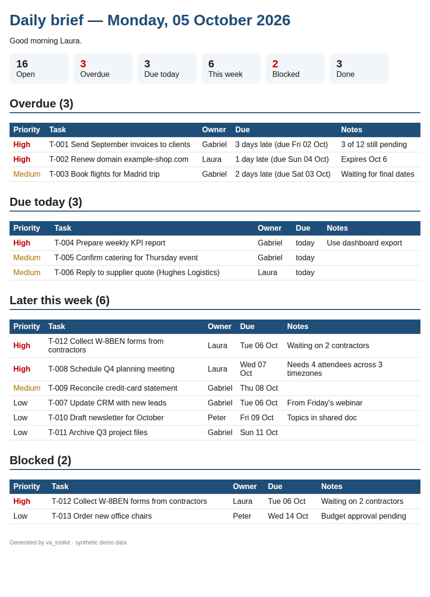

# Virtual Assistant Toolkit

[](https://github.com/gabrielvalle-491/virtual-assistant-toolkit/actions/workflows/ci.yml)


[English](README.md) · **Español**

Un kit de herramientas en Python que automatiza cinco tareas diarias de un asistente virtual:
borradores de email, agenda de reuniones entre zonas horarias, organización de archivos, reportes de
gastos y un resumen diario de tareas. Todo se ejecuta desde una sola línea de comandos
(`python -m va_toolkit <comando>`), lee los Excel/CSV con los que ya trabaja un asistente y genera
archivos que el gerente puede abrir directamente.

> Proyecto de portfolio. Todos los nombres, empresas, emails y montos son **sintéticos** y fueron
> generados por `generate_samples.py`. No es trabajo para clientes.

## El problema de negocio

Gran parte de la semana de un asistente virtual se va en tareas administrativas repetitivas, lentas y
fáciles de equivocar a mano:

- escribir el mismo recordatorio de pago a una docena de clientes cambiando nombre, monto y fecha;
- encontrar horarios cuando el gerente está en Buenos Aires y los invitados en Nueva York, Londres y Sídney;
- ordenar una carpeta de Descargas llena de facturas, capturas y duplicados tipo "archivo (1).pdf";
- convertir un mes de comprobantes en un reporte de gastos y revisar cada línea contra la política;
- contarle al gerente cada mañana qué está vencido, qué vence hoy y qué está bloqueado.

Este kit resuelve cada una en segundos, y cada módulo **valida primero los datos** (emails inválidos,
campos faltantes, horarios imposibles, gastos fuera de política), así el asistente revisa solo las
excepciones en lugar de controlar todo de nuevo.

## Funcionalidades

| Módulo | Entrada | Salida | Destacado |
|---|---|---|---|
| `mail_merge` | Lista de contactos (`.xlsx`) + plantilla Jinja2 | Un borrador `.eml` por contacto + `mail_merge_summary.xlsx` | Detecta emails inválidos/duplicados y campos vacíos; los borradores se abren como editables (`X-Unsent: 1`); **nunca envía emails** |
| `scheduler` | Pedidos de reunión (`.xlsx`) + disponibilidad (`.xlsx`) | Invitación `.ics` por reunión, `agenda.ics`, `agenda.xlsx` | Zonas horarias con `zoneinfo` (incluye horario de verano), días y horas preferidos controlados en la zona del invitado, sin superposiciones + 15 min de margen, explica por qué no se pudo agendar |
| `file_organizer` | Una carpeta desordenada | Carpetas `<categoría>/<AAAA-MM>/`, registro para deshacer (`.csv`) | Facturas detectadas por nombre (invoice/factura/receipt), mes desde el nombre o la fecha de modificación, duplicados por SHA-256, `--dry-run`, `--copy`, `undo` completo |
| `expense_report` | Comprobantes (`.csv`) | `expense_report_AAAA-MM.xlsx` (3 hojas) | Fórmulas `SUMIF`/`COUNTIFS`, gráfico de barras, conversión de moneda, marca comidas > USD 25/día, ítems > USD 500, comprobantes faltantes y duplicados |
| `daily_brief` | Tareas (`.xlsx`) | `daily_brief_AAAA-MM-DD.md` + `.html` | Vencidas / vencen hoy / resto de la semana / bloqueadas, ordenadas por prioridad y fecha |

## Inicio rápido

```bash
git clone https://github.com/gabrielvalle-491/virtual-assistant-toolkit.git
cd virtual-assistant-toolkit
pip install -r requirements.txt

python generate_samples.py          # (opcional) regenera los datos sintéticos en samples/
python -m va_toolkit demo           # ejecuta los cinco módulos sobre samples/ -> output/
pytest                              # 53 tests
```

Un módulo sobre tus propios archivos:

```bash
python -m va_toolkit mail-merge contactos.xlsx plantilla.txt --out output/mail_merge --sender "Yo <yo@example.com>"
python -m va_toolkit schedule pedidos.xlsx disponibilidad.xlsx --tz America/Argentina/Buenos_Aires
python -m va_toolkit organize ~/Descargas --dest ~/Ordenado --dry-run --log plan.csv   # solo vista previa
python -m va_toolkit organize ~/Descargas --dest ~/Ordenado --log undo_log.csv        # ejecutar
python -m va_toolkit undo undo_log.csv                                                # deshacer
python -m va_toolkit expenses comprobantes.csv --month 2026-09
python -m va_toolkit brief tareas.xlsx --today 2026-10-05 --manager Laura
```

## Resultados reales con los datos de ejemplo

Todo lo siguiente se copió de `python -m va_toolkit demo` (la salida de la consola está en inglés).
Los archivos generados están en [`output/`](output/).

### 1. Mail merge — recordatorios de pago

```text
Mail merge: 7 drafts written, 5 contacts skipped -> output/mail_merge
  row   6 Tom Becker             SKIPPED: invalid email 'tom.becker@example'
  row   7 Nakamura               SKIPPED: missing field(s): first_name
  row   8 Sofía Ruiz             SKIPPED: missing field(s): amount_due
  row  10 Ana Torres             SKIPPED: duplicate email
  row  12 Javier Morales         SKIPPED: missing email
```

7 borradores listos y 5 contactos separados para revisar, cada uno con el motivo.

### 2. Agenda — 8 pedidos, 6 zonas horarias

Disponibilidad: lunes 5 a viernes 9 de octubre de 2026, 09:00–12:00 y 14:00–18:00 hora de Buenos Aires.

```text
Scheduler: 6 meetings booked, 2 unscheduled -> output/scheduler
  Mon 05 Oct 10:00-11:00  Olivia Carter      Quarterly review             (their time Mon 09:00 America/New_York)
  Mon 05 Oct 11:15-11:45  Marta López        Marketing sync               (their time Mon 16:15 Europe/Madrid)
  Mon 05 Oct 14:00-14:30  Valentina Rossi    Invoice reconciliation       (their time Mon 14:00 America/Argentina/Buenos_Aires)
  Mon 05 Oct 14:45-15:15  Carlos Méndez      Weekly 1:1                   (their time Mon 11:45 America/Mexico_City)
  Tue 06 Oct 09:00-09:45  James Patel        Supplier onboarding call     (their time Tue 13:00 Europe/London)
  Thu 08 Oct 14:00-15:30  Ryan Brooks        Website redesign kickoff     (their time Thu 10:00 America/Los_Angeles)
  NOT BOOKED  Hannah Lee         Partnership intro            no availability overlaps the attendee's preferred days/hours
  NOT BOOKED  Olivia Carter      Budget follow-up             all matching slots already booked
```

Hannah está en Sídney: su horario 09:00–17:00 equivale a 19:00–03:00 en Buenos Aires, así que la
herramienta lo informa en lugar de agendarla a las 3 de la mañana.

### 3. Organizador de archivos — 16 archivos desordenados

```text
File organizer: 16 files copied -> output/file_organizer/organized
  archives      1
  docs          3
  duplicate     2
  images        3
  invoices      3
  media         1
  other         1
  spreadsheets  2
  duplicate: IMG_20260915_101233 - Copy.jpg  (same content as IMG_20260915_101233.jpg)
  duplicate: Invoice_ACME_2026-09-14 (1).pdf  (same content as Invoice_ACME_2026-09-14.pdf)
  undo log: output/file_organizer/undo_log.csv
```

(La demo usa `--copy` para no tocar `samples/`; por defecto los archivos se mueven.)

### 4. Reporte de gastos — septiembre 2026

```text
Expense report 2026-09: 39 receipts, total USD 1,712.52
  Travel           USD    612.00
  Lodging          USD    368.00
  Meals            USD    248.07
  Office Supplies  USD    231.73
  Transport        USD    202.30
  Software         USD     50.42
  5 items flagged:
    2026-09-16 Peter Novak    Meals           USD    21.40  meals USD 31.20 that day > USD 25/day cap
    2026-09-16 Peter Novak    Meals           USD     9.80  meals USD 31.20 that day > USD 25/day cap
    2026-09-18 Laura Gómez    Office Supplies USD    42.30  possible duplicate
    2026-09-22 Aisha Bello    Travel          USD   612.00  over USD 500: needs manager approval
    2026-09-23 Aisha Bello    Meals           USD    31.00  missing receipt; meals USD 31.00 that day > USD 25/day cap
```

El Excel tiene una hoja **Summary** con fórmulas y gráfico, una hoja **Expenses** con las filas marcadas
en rojo y una hoja **Policy flags**. Los tipos de cambio ARS/EUR son fijos e ilustrativos (`ExpensePolicy`).

### 5. Resumen diario — lunes 5 de octubre de 2026

```text
Daily brief 2026-10-05: 16 open, 3 overdue, 3 due today, 6 this week, 2 blocked -> output/daily_brief
```



## Tests

```text
$ pytest -q
.....................................................                    [100%]
53 passed in 0.62s
```

GitHub Actions ejecuta `ruff` y `pytest` en Python 3.11 y 3.12.

## Estructura

```text
virtual-assistant-toolkit/
├── va_toolkit/          # cli, excel_utils, mail_merge, scheduler, file_organizer, expense_report, daily_brief
├── samples/             # datos sintéticos de entrada (generate_samples.py)
├── output/              # salida real de `python -m va_toolkit demo`
├── tests/               # 53 tests con pytest
├── docs/daily_brief.png
├── generate_samples.py
└── .github/workflows/ci.yml
```

## Autor

Gabriel Valle — Virtual Assistant & Automation · Villa Mercedes, Argentina · Remote

Licencia [MIT](LICENSE).
